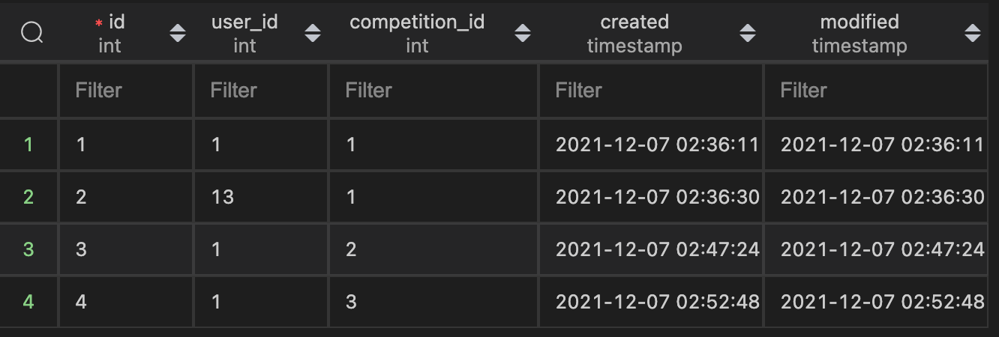

# Project Name: Simple Arcade
## Project Summary: This project will create a simple Arcade with scoreboards and competitions based on the implemented game.
## Github Link: https://github.com/waqaspathan00/IT202-011/tree/dev/public_html
## Project Board Link: https://github.com/users/waqaspathan00/projects/2
## Website Link: (Heroku Prod of Project folder): https://wp23-prod.herokuapp.com/Project/home.php
## Your Name: Waqas Pathan

<!--
### Line item / Feature template (use this for each bullet point)
#### Don't delete this

- [ ] \(mm/dd/yyyy of completion) Feature Title (from the proposal bullet point, if it's a sub-point indent it properly)
  -  List of Evidence of Feature Completion
    - Status: Pending (Completed, Partially working, Incomplete, Pending)
    - Direct Link: (Direct link to the file or files in heroku prod for quick testing (even if it's a protected page))
    - Pull Requests
      - PR link #1 (repeat as necessary)
    - Screenshots
      - Screenshot #1 (paste the image so it uploads to github) (repeat as necessary)
        - Screenshot #1 description explaining what you're trying to show
### End Line item / Feature Template
--> 
### Proposal Checklist and Evidence

- Milestone 1
    - [x] \(10/19/2021 of completion) User will be able to edit their profile
        -  List of Evidence of Feature Completion
            - Status: Completed
            - Direct Link: https://wp23-prod.herokuapp.com/Project/profile.php
            - Pull Requests
            - https://github.com/waqaspathan00/IT202-011/pull/31 
            - Screenshots
            - 
                - This is the profile page. All of the fields are textboxes which the user can change the values of
    - [x] \(11/07/2021 of completion) User will be able to see their profile
        -  List of Evidence of Feature Completion
            - Status: Completed
            - Direct Link: https://wp23-prod.herokuapp.com/Project/profile.php
            - Pull Requests
            - https://github.com/waqaspathan00/IT202-011/pull/31 
            - Screenshots
            - 
                - This is the profile page. When the user accesses this page it is preloaded with all of their current information
    - [x] \(10/12/2021 of completion) Any output messages or errors should be user friendly
        -  List of Evidence of Feature Completion
            - Status: Completed
            - Direct Link: https://wp23-prod.herokuapp.com/Project/login.php 
            - Pull Requests
            - https://github.com/waqaspathan00/IT202-011/pull/7 
            - Screenshots
            - 
                - When the user logs in with the incorrect password they are presented with an error message telling them what went wrong
    - [x] \(11/07/2021 of completion) Site should have basic styles and theme applied
        -  List of Evidence of Feature Completion
            - Status: Completed
            - https://wp23-prod.herokuapp.com/Project/login.php
            - Pull Requests
            - https://github.com/waqaspathan00/IT202-011/pull/34
            - Screenshots
            - 
                - Throughout the entire site I have a nav bar, using bootstrap, and applied color
    - [x] \(11/07/2021 of completion) Basic roles implemented
        -  List of Evidence of Feature Completion
            - Status: Completed
            - Direct Link: https://wp23-prod.herokuapp.com/Project/admin/list_roles.php
            - Pull Requests
            - https://github.com/waqaspathan00/IT202-011/pull/35
            - Screenshots
            - 
                - This screenshot shows the list of different available roles
    - [x] \(11/07/2021 of completion) Basic security rules implemented
        -  List of Evidence of Feature Completion
            - Status: Completed
            - Direct Link: https://wp23-prod.herokuapp.com/Project/admin/list_roles.php
            - Pull Requests
            - https://github.com/waqaspathan00/IT202-011/pull/35
            - Screenshots
            - 
                - Vvarma who is not an admin being denied access to one of the admin pages (list roles)
    - [x] \(10/07/2021 of completion) User will be able to log out
        -  List of Evidence of Feature Completion
            - Status: Completed
            - Direct Link: https://wp23-prod.herokuapp.com/Project/logout.php
            - Pull Requests
            - https://github.com/waqaspathan00/IT202-011/pull/10
            - Screenshots
            - 
                - First the user in logged in and they are given the option to logout
            - 
                - The screen after the user clicks logout
    - [x] \(10/05/2021 of completion) User will be able to log into their account
        -  List of Evidence of Feature Completion
            - Status: Completed
            - Direct Link: https://wp23-prod.herokuapp.com/Project/login.php
            - Pull Requests
            - https://github.com/waqaspathan00/IT202-011/pull/6
            - https://github.com/waqaspathan00/IT202-011/pull/10
            - Screenshots
            - 
                - The user enters their username and password
            - 
                - The user is logged in and greeted with welcome message
    - [x] \(10/05/2021 of completion) User will be register an account
        -  List of Evidence of Feature Completion
            - Status: Completed
            - Direct Link: https://wp23-prod.herokuapp.com/Project/register.php
            - Pull Requests
            - https://github.com/waqaspathan00/IT202-011/pull/5
            - https://github.com/waqaspathan00/IT202-011/pull/6
            - Screenshots
            - 
                - Filling in new account information
            - 
                - Account creation is successful
            - 
                - Logging in with new account
    
- Milestone 2
    - [x] \(11/10/2021 of completion) Pick a simple game to implement, anything that generates a score that’s more advanced than a simple random number generator (may build off of a sample from the site shared in class)
      -  List of Evidence of Feature Completion
        - Status: Completed
        - Direct Link: https://wp23-prod.herokuapp.com/Project/home.php
        - Pull Requests
          - https://github.com/waqaspathan00/IT202-011/pull/38 
        - Screenshots
          - 
            - The game is available to be played on the homepage
    - [x] \(11/21/2021 of completion) The system will save the user’s score at the end of the game if the user is logged in
      -  List of Evidence of Feature Completion
        - Status: Completed
        - Direct Link: https://wp23-prod.herokuapp.com/Project/home.php
        - Pull Requests
          - https://github.com/waqaspathan00/IT202-011/pull/58
        - Screenshots
          - 
            - The score being saved after finished game
          - 
            - The score being saved into db
    - [x] \(11/21/2021 of completion) The user will be able to see their last 10 scores
      -  List of Evidence of Feature Completion
        - Status: Completed
        - Direct Link: https://wp23-prod.herokuapp.com/Project/profile.php
        - Pull Requests
          - https://github.com/waqaspathan00/IT202-011/pull/58
        - Screenshots
          - 
            - The last 10 scores of the user will be displayed
    - [x] \(11/24/2021 of completion) Create functions that output the following scoreboards (this will be used later)
      -  List of Evidence of Feature Completion
        - Status: Completed
        - Direct Link: https://wp23-prod.herokuapp.com/Project/scoreboard.php
        - Pull Requests
          - https://github.com/waqaspathan00/IT202-011/pull/58
        - Screenshots
          - 
            - The top 10 scores for the last week
          - 
            - The top 10 scores for the last month
          - 
            - Lifetime top 10 high scores
- Milestone 3
  - [x] \(11/30/2021) Users will have points associated with their account
    -  List of Evidence of Feature Completion
      - Status: Completed
      - Direct Link: https://wp23-prod.herokuapp.com/Project/profile.php
      - Pull Requests
        - https://github.com/waqaspathan00/IT202-011/pull/61
      - Screenshots
        - 
          - Current points of the logged in user is 10
  - [x] \(11/30/2021) Create a PointsHistory table
    -  List of Evidence of Feature Completion
      - Status: Completed
      - Direct Link: https://wp23-prod.herokuapp.com/Project/profile.php
      - Pull Requests
        - https://github.com/waqaspathan00/IT202-011/pull/61
      - Screenshots
        - 
          - Screenshot of the points history table
  - [x] \(12/04/2021 of completion) Competitions table should have the following columns
    -  List of Evidence of Feature Completion
      - Status: Completed
      - Direct Link: https://wp23-prod.herokuapp.com/Project/competition.php
      - Pull Requests
        - https://github.com/waqaspathan00/IT202-011/pull/62
      - Screenshots
        - 
          - Screenshot of the competitions table
  - [x] \(12/04/2021 of completion) User will be able to create a competition
    -  List of Evidence of Feature Completion
      - Status: Completed
      - Direct Link: https://wp23-prod.herokuapp.com/Project/create_competition.php
      - Pull Requests
        - https://github.com/waqaspathan00/IT202-011/pull/62
      - Screenshots
        - 
          - Users can create competitions and modify their params
  - [x] \(12/07/2021 of completion) Each new participant causes the reward value to increase by atleast 1 or 50% of the joining fee rounded up
    -  List of Evidence of Feature Completion
      - Status: Completed
      - Direct Link: https://wp23-prod.herokuapp.com/Project/join_competition.php
      - Pull Requests
        - PR link #1 https://github.com/waqaspathan00/IT202-011/pull/63
      - Screenshots
        - 
          - The first competition has 2 participants and 1 more reward value then the ones below it which only have 1 participant and 1 less reward value
  - [x] \(12/07/2021 of completion) Have a page where the User can see active competitions (not expired)
    -  List of Evidence of Feature Completion
      - Status: Completed
      - Direct Link: https://wp23-prod.herokuapp.com/Project/join_competition.php
      - Pull Requests
        - https://github.com/waqaspathan00/IT202-011/pull/63
      - Screenshots
        - 
          - Users can join competition, this one has created all of them so they are automatically "joined"
  - [x] \(mm/dd/yyyy of completion) Will need an association table CompetitionParticipants (id, comp_id, user_id, created) (from the proposal bullet point, if it's a sub-point indent it properly)
    -  List of Evidence of Feature Completion
      - Status: Completed
      - Pull Requests
        - https://github.com/waqaspathan00/IT202-011/pull/64
      - Screenshots
        - 
          - A screenshot of the competition participants table
  - [x] \(mm/dd/yyyy of completion) User can join active competitions (from the proposal bullet point, if it's a sub-point indent it properly)
    -  List of Evidence of Feature Completion
      - Status: Completed
      - Direct Link: https://wp23-prod.herokuapp.com/Project/join_competition.php
      - Pull Requests
        - https://github.com/waqaspathan00/IT202-011/pull/63
      - Screenshots
        - 
          - Screenshot of the user having joined active competitions
  - [ ] \(mm/dd/yyyy of completion) Create function that calculates competition winners (from the proposal bullet point, if it's a sub-point indent it properly)
    -  List of Evidence of Feature Completion
      - Status: Incomplete
        - The functions dont work after changing the table references and columns. I know theres a problem with the queuries but I cant figure it out because the queuries are too long and hard to debug
  
- Milestone 4
  - [ ] \(mm/dd/yyyy of completion) User can set their profile to be public or private
    -  List of Evidence of Feature Completion
      - Status: Pending (Completed, Partially working, Incomplete, Pending)
      - Direct Link: (Direct link to the file or files in heroku prod for quick testing (even if it's a protected page))
      - Pull Requests
        - PR link #1 (repeat as necessary)
      - Screenshots
        - Screenshot #1 (paste the image so it uploads to github) (repeat as necessary)
          - Screenshot #1 description explaining what you're trying to show
  - [ ] \(mm/dd/yyyy of completion) Uesrs will be able to see their competition history
    -  List of Evidence of Feature Completion
      - Status: Pending (Completed, Partially working, Incomplete, Pending)
      - Direct Link: (Direct link to the file or files in heroku prod for quick testing (even if it's a protected page))
      - Pull Requests
        - PR link #1 (repeat as necessary)
      - Screenshots
        - Screenshot #1 (paste the image so it uploads to github) (repeat as necessary)
          - Screenshot #1 description explaining what you're trying to show
  - [ ] \(mm/dd/yyyy of completion) User with the role of admin can edit a competition where paid_out = false
    -  List of Evidence of Feature Completion
      - Status: Pending (Completed, Partially working, Incomplete, Pending)
      - Direct Link: (Direct link to the file or files in heroku prod for quick testing (even if it's a protected page))
      - Pull Requests
        - PR link #1 (repeat as necessary)
      - Screenshots
        - Screenshot #1 (paste the image so it uploads to github) (repeat as necessary)
          - Screenshot #1 description explaining what you're trying to show
  - [ ] \(mm/dd/yyyy of completion) Add pagination to Active Competitions view
    -  List of Evidence of Feature Completion
      - Status: Pending (Completed, Partially working, Incomplete, Pending)
      - Direct Link: (Direct link to the file or files in heroku prod for quick testing (even if it's a protected page))
      - Pull Requests
        - PR link #1 (repeat as necessary)
      - Screenshots
        - Screenshot #1 (paste the image so it uploads to github) (repeat as necessary)
          - Screenshot #1 description explaining what you're trying to show
  - [ ] \(mm/dd/yyyy of completion) Anywhere a username is displayed should be a link to that users profile
    -  List of Evidence of Feature Completion
      - Status: Pending (Completed, Partially working, Incomplete, Pending)
      - Direct Link: (Direct link to the file or files in heroku prod for quick testing (even if it's a protected page))
      - Pull Requests
        - PR link #1 (repeat as necessary)
      - Screenshots
        - Screenshot #1 (paste the image so it uploads to github) (repeat as necessary)
          - Screenshot #1 description explaining what you're trying to show
  - [ ] \(mm/dd/yyyy of completion) Viewing an active or expired competition should show the top 10 scoreboard related to that competition
    -  List of Evidence of Feature Completion
      - Status: Pending (Completed, Partially working, Incomplete, Pending)
      - Direct Link: (Direct link to the file or files in heroku prod for quick testing (even if it's a protected page))
      - Pull Requests
        - PR link #1 (repeat as necessary)
      - Screenshots
        - Screenshot #1 (paste the image so it uploads to github) (repeat as necessary)
          - Screenshot #1 description explaining what you're trying to show
  - [ ] \(mm/dd/yyyy of completion) Game should be fully implemented/ complete by this point
    -  List of Evidence of Feature Completion
      - Status: Pending (Completed, Partially working, Incomplete, Pending)
      - Direct Link: (Direct link to the file or files in heroku prod for quick testing (even if it's a protected page))
      - Pull Requests
        - PR link #1 (repeat as necessary)
      - Screenshots
        - Screenshot #1 (paste the image so it uploads to github) (repeat as necessary)
          - Screenshot #1 description explaining what you're trying to show
  - [ ] \(mm/dd/yyyy of completion) Users score history will include pagination
    -  List of Evidence of Feature Completion
      - Status: Pending (Completed, Partially working, Incomplete, Pending)
      - Direct Link: (Direct link to the file or files in heroku prod for quick testing (even if it's a protected page))
      - Pull Requests
        - PR link #1 (repeat as necessary)
      - Screenshots
        - Screenshot #1 (paste the image so it uploads to github) (repeat as necessary)
          - Screenshot #1 description explaining what you're trying to show
  - [ ] \(mm/dd/yyyy of completion) Home page will have a weekly, monthly and lifetime scoreboard
    -  List of Evidence of Feature Completion
      - Status: Pending (Completed, Partially working, Incomplete, Pending)
      - Direct Link: (Direct link to the file or files in heroku prod for quick testing (even if it's a protected page))
      - Pull Requests
        - PR link #1 (repeat as necessary)
      - Screenshots
        - Screenshot #1 (paste the image so it uploads to github) (repeat as necessary)
          - Screenshot #1 description explaining what you're trying to show
  

### Intructions
#### Don't delete this
1. Pick one project type
2. Create a proposal.md file in the root of your project directory of your GitHub repository
3. Copy the contents of the Google Doc into this readme file
4. Convert the list items to markdown checkboxes (apply any other markdown for organizational purposes)
5. Create a new Project Board on GitHub
   - Choose the Automated Kanban Board Template
   - For each major line item (or sub line item if applicable) create a GitHub issue
   - The title should be the line item text
   - The first comment should be the acceptance criteria (i.e., what you need to accomplish for it to be "complete")
   - Leave these in "to do" status until you start working on them
   - Assign each issue to your Project Board (the right-side panel)
   - Assign each issue to yourself (the right-side panel)
6. As you work
  1. As you work on features, create separate branches for the code in the style of Feature-ShortDescription (using the Milestone branch as the source)
  2. Add, commit, push the related file changes to this branch
  3. Add evidence to the PR (Feat to Milestone) conversation view comments showing the feature being implemented
     - Screenshot(s) of the site view (make sure they clearly show the feature)
     - Screenshot of the database data if applicable
     - Describe each screenshot to specify exactly what's being shown
     - A code snippet screenshot or reference via GitHub markdown may be used as an alternative for evidence that can't be captured on the screen
  4. Update the checklist of the proposal.md file for each feature this is completing (ideally should be 1 branch/pull request per feature, but some cases may have multiple)
    - Basically add an x to the checkbox markdown along with a date after
      - (i.e.,   - [x] (mm/dd/yy) ....) See Template above
    - Add the pull request link as a new indented line for each line item being completed
    - Attach any related issue items on the right-side panel
  5. Merge the Feature Branch into your Milestone branch (this should close the pull request and the attached issues)
    - Merge the Milestone branch into dev, then dev into prod as needed
    - Last two steps are mostly for getting it to prod for delivery of the assignment 
  7. If the attached issues don't close wait until the next step
  8. Merge the updated dev branch into your production branch via a pull request
  9. Close any related issues that didn't auto close
    - You can edit the dropdown on the issue or drag/drop it to the proper column on the project board
